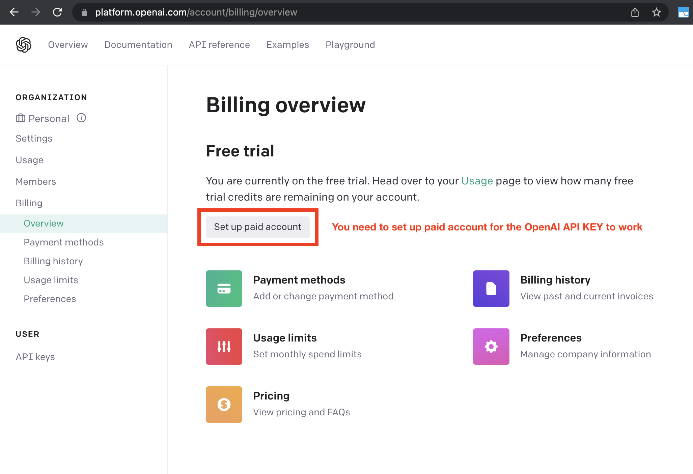

# Kubectl-GPT: Kubenetes cli powered by GPT | Quick Hack

Kubectl-GPT is an experimental open-source tool designed for running kubectl commands using GPT.
The tool is powered by GPT3.5 and Langchain

_Searching for the exact kubectl command can be challenging, so this is a convenient way to find it._


https://user-images.githubusercontent.com/7579608/232610592-b95ead34-3d9e-424f-8069-cf8ce8e48f98.mp4


## 📋 Requirements

- Python 3.10 or later (instructions: [for Windows](https://www.tutorialspoint.com/how-to-install-python-in-windows))
- [OpenAI API key](https://platform.openai.com/account/api-keys)
- Kubernetes [Installed](https://kubernetes.io/)
- Kubectl [Installed](https://kubernetes.io/docs/reference/kubectl/)


## ⚠️ OpenAI API Keys Configuration ⚠️ 

Obtain your OpenAI API key from: https://platform.openai.com/account/api-keys.

To use OpenAI API key for Auto-GPT, you **NEED** to have billing set up (AKA paid account).

You can set up paid account at https://platform.openai.com/account/billing/overview.




#### **PLEASE ENSURE YOU HAVE DONE THIS STEP BEFORE PROCEEDING, OTHERWISE NOTHING WILL WORK!**

## 💾 Installation

To try k8scli-gpt, follow these steps:
1. Make sure you have all the **requirements** listed above, if not, install/get them

2. Clone the repository: 
    ```bash
        git clone https://github.com/Significant-Gravitas/Auto-GPT.git
    ```

3. Navigate to the directory where the repository was downloaded

    ```bash
    cd k8scli-GPT
    ```
4. Install the required dependencies

    ```bash
    pip install -r requirements.txt
    ```

5. Configure OpenAI Key
    * If Using OpenAI key, simply `export OPENAI_API_KEY=*****`
    * If want to use config file, rename `config_template.ini` -> `config.ini` file inside the `k8scli-GPT` dir & update either Azure or OpenAI config

    By completing these steps, you have properly configured the API Keys for your project.
   
   - See [OpenAI API Keys Configuration](#openai-api-keys-configuration) to obtain your OpenAI API key.
   - Details can be found here: https://pypi.org/project/openai/ in the `Microsoft Azure Endpoints` section and here: https://learn.microsoft.com/en-us/azure/cognitive-services/openai/tutorials/embeddings?tabs=command-line for the embedding model.


## 🔧 Usage

Run `k8scli-GPT` Python module in your terminal

```
python -m kgpt "list all pods"
```
```
python -m kgpt "what is the cpu usage of the pod testing in the namespace xyz"
```
